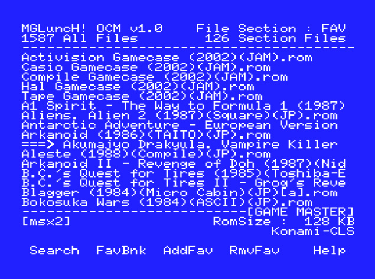

# mgLunch4Ocm
## Launcher for MSX romfile - 1chipMSX

mgLunch! is a MSX ROM launcher for the  "KDL firmware's OneChip MSX"

v1.2f :

### USAGE

    mgLunch.com - mgLunch! for OCM 
    mglOcm.com  - romloader for OCM
    mglCook.exe - rom file scanner for Windows xp/vista/7/8/8.1/10 

### Operation Keys

    [F1] Search : Search Rom File 
    [F2] FavBnk : Change to Favorite section
    [F3] AddFav : Add to Favorite
    [F4] RmvFav : Remove from Favorite
    [F5] Help 
    [F10] Exit to DOS
    [SPACE] : File Select Mode
    [0]~[Z] : Fast Change File Section
    [CTRL]+[CURSOR] : Fast Cursor Scroll

### ...And more some command options are as below in 'File Select Mode' 

    [RETURN] = Execute Rom file
    [k] = forced execute rom on Konami classic Mapper - faster than autodetect
    [s] = forced execute rom on Konami-SCC Mapper - faster than autodetect
    [8] = forced execute rom on Ascii-8 Mapper - faster than autodetect
    [f] = forced execute rom on Ascii16 Mapper - faster than autodetect
    [o] = Konami game master combination option
    [t] = Z80B 5.37MHz Panasonic Turbo mode - 
    [r] = Execute rom file by alternate method 

### REQUIREMENTS

    MSXDOS2, Nextor, kdl firmware of v3.1 and over .

### 'mgLunch' , "mglOcm", "mglCook" are written by ToughkidCST

### CONTACT
toughkiddev@gmail.com

### Youtube Video Links
- https://www.youtube.com/watch?v=YnKgH6TTlg0&list=PLlD0W14KLTkpq5dnONr_U6fAUWuyGliEw&index=77
- https://www.youtube.com/watch?v=oNPzevBzs64&list=PLlD0W14KLTkpq5dnONr_U6fAUWuyGliEw&index=80
- https://www.youtube.com/watch?v=dIU_seNB6-E&list=PLlD0W14KLTkpq5dnONr_U6fAUWuyGliEw&index=7
- https://www.youtube.com/watch?v=PuNxzULH6jQ&list=PLlD0W14KLTkpq5dnONr_U6fAUWuyGliEw&index=8
- https://www.youtube.com/watch?v=2cmA5ZL4a7k&list=PLlD0W14KLTkpq5dnONr_U6fAUWuyGliEw&index=75
- https://www.youtube.com/watch?v=7YDBAJa8rag&list=PLlD0W14KLTkpq5dnONr_U6fAUWuyGliEw&index=76
